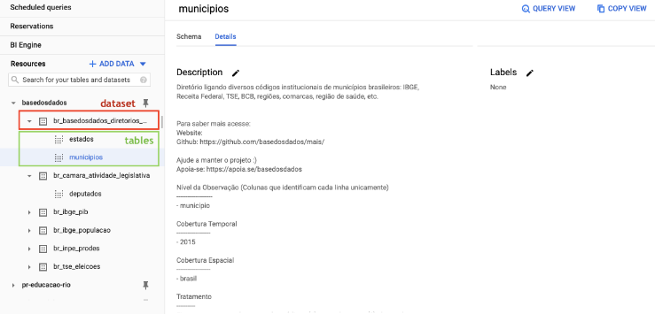
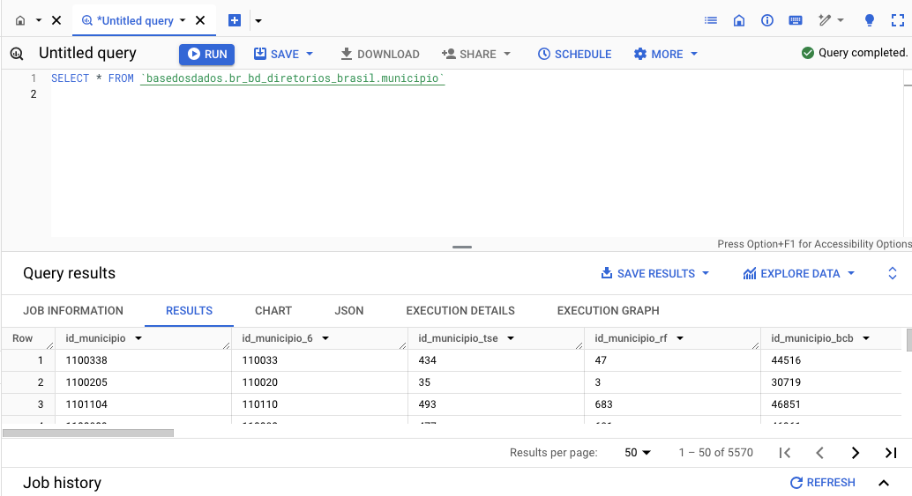
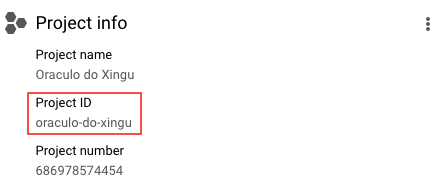

# Resumo da documentação
__A missão da Base dos Dados é universalizar o uso de dados de qualidade no Brasil.__

## BigQuery
O BigQuery é o um serviço de banco de dados em nuvem da Google. Você faz __consultas ao banco em SQL direto do navegador__ com:

__Rapidez:__ Mesmo queries muito longas demoram apenas minutos para serem processadas.

__Escala:__ O BigQuery escala magicamente para hexabytes se necessário.

__Economia:__ Todo usuário possui 1 TB gratuito por mês para consulta aos dados.

### Primeiros passos

- __Criando o projeto__

Para criar um projeto no Google Cloud basta ter um __email cadastrado no Google__, e ter um __projeto seu__, mesmo que vazio, para você fazer queries em nosso datalake público.

- __Acessando o datalake da basedosdados__

Dentro do projeto existem __dois níveis de organização dos dados__, __datasets__ (conjuntos de dados) e __tables__ (tabelas), nos quais:

1. __Todas as tabelas estão organizadas dentro de cojuntos de dados__, que representaam sua organização/tema.

2. __Cada tabela pertence a um único conjunto de dados__



- __Fazendo a primeira consulta__

Para fazer uma consulta simples vamos usar o Editor de Consultas do BigQuery para ver as informações sobre municípios direto na nossa base de diretórios brasileiros em nossos dados. Para isso, basta copiar e colar o código abaixo:

``SELECT * FROM `basedosdados.br_bd_diretorios_brasil.municipio``



### Otimizando o uso do Big Query

Para usuários que acessam os dados em projetos públicos como o da Base dos Dados o único tipo de custo associado se refere ao custo de __processamento das consultas__. A notícia boa, como mencionado acima, é que todo usuário possui 1 TB gratuito por mês para consultar livremente os dados do maior data lake público do Brasil.

- __Dica 1: Selecionando somentes as colunas de interesse__

A arquitetura do Big Query utiliza o armazenamento orientado a colunas. Esta característica tem uma implicação clara quanto aos custos de processamento: __quanto mais colunas forem selecionadas, maior será o custo__. Logo, a prática recomendada é selecionar somente as colunas de interesse para reduzir o custo final da consulta. De forma genérica podemos fazer isso com o seguinte comando:

`SELECT colunaX, colunaY FROM basedosdados `

- __Dica 2: Utilize colunas particionadas e clusterizadas para filtrar os dados__

As __partições__ são __divisões feitas em uma tabela__ para facilitar o gerenciamento e a consulta dos dados. No momento de execução da consulta, o Big Query ignora linhas que possuem um valor da partição diferente do utilizado no filtro. Isto normalmente reduz significativamente a quantidade de linhas lidas e, o que nos interessa, __reduz o custo de processamento__.

__Clusters__ são __agrupamentos organizados em uma tabela com base nos valores de uma ou mais colunas especificadas__. Isso significa que, ao invés de escanear toda a tabela, apenas as partes necessárias são lidas, o que geralmente reduz a quantidade de dados processados e, consequentemente, __reduz o custo de processamento__.

Um exemplo genérico da nossa basedosdados:

``SELECT sequencial_obito, tipo_obito, data_obito FROM `basedosdados.br_ms_sim.microdados` WHERE ano = 2015``

Na cláusula __WHERE__ da consulta SQL, estamos utilizando uma __condição de igualdade para filtrar os registros__. Especificamente, a condição `ano = 2015` verifica se o valor da coluna ano é igual a 2015. Esse método de filtragem é conhecido como comparação de igualdade.

- __Dica 3: Muita atenção ao realizar joins entre tabelas__

### Tutoriais
Nesta seção irei fazer um resumo de cada tutorial da documentação.

- __[Como navegar pelo BigQuery](https://dev.to/basedosdados/bigquery-101-45pk)__

Neste tutorial aprendemos a como utilizar a plataforma porém no modelo antigo. O modelo atualizado conta com um novo layout.

- __[Entendendo os dados](https://basedosdados.github.io/mais/style_data/)__

O BigQuery possui um mecanismo de busca que permite buscar por nomes de __datasets (conjuntos), tables (tabelas) ou labels (grupos)__. Nessa seção listamos todos os padrões do nosso manual de estilo e diretrizes de dados que usamos na Base dos Dados. Eles nos ajudam a manter os dados e metadados que publicamos com qualidade alta.

- __[Conectando com o PowerBI](https://dev.to/basedosdados/tutorial-power-bi-j6d)__

O Power BI é uma das tecnologias mais populares para o desenvolvimento de dashboards com dados relacionais, e a Base dos Dados é um dos __maiores data lakes públicos do Brasil__. Essa combinação é o ambiente perfeito para sua análise e a visualização de dados.

- __Outros manuais e Cursos de SQL__

1. [Lista de funções em SQL da W3](https://www.w3schools.com/sql/default.Asp)
2. [Curso SQL na Codeacademy](https://www.codecademy.com/learn/learn-sql)
3. [Curso de SQL do Programação Dinâmica](https://www.youtube.com/watch?v=z32438Yehl4&list=PL5TJqBvpXQv5n1N15kcK1m9oKJm_cv-m6&index=2)

## Pacotes

Os pacotes da Base dos Dados permitem o acesso ao datalake público direto do seu computador ou ambiente de desenvolvimento.

### Primeiros passos

- __Criando o projeto__

- __Instalando o pacote__

Para instalação do pacote em Python e linha de comando, você pode usar o `pip` direto do seu terminal.

`pip install basedosdados` 

Para este caso, devemos fazer o downgrade do pacote protobuf.

`pip install protobuf==3.20`

- __Configurando o pacote__

Uma vez com seu projeto, você precisa configurar o pacote para usar o ID desse projeto nas consultas ao datalake. Para isso, você deve usar o __project_id__ que a Google fornece para você assim que o projeto é criado.



Para Python, não é necessário configurar o projeto de antemão. Assim que você roda a 1ª consulta, o pacote irá indicar os passos para configuração.

- __Fazendo a primeira consulta__

Um exemplo simples para começar a explorar o datalake é __puxar informações cadastrais de municípios direto na nossa base de Diretórios Brasileiros__ (tabela municipio). Para isso, vamos usar a __função download__, baixando os dados direto para nossa máquina.

```` py
import basedosdados as bd
bd.download(savepath="<PATH>",
dataset_id="br-bd-diretorios-brasil", table_id="municipio")
````

### Tutoriais 
Preparamos tutoriais apresentando as principais funções de cada pacote para você começar a usá-los.

- __[Introdução ao pacote Python pt1](https://dev.to/basedosdados/base-dos-dados-python-101-44lc)__

- __[Introdução ao pacote Python pt2](https://dev.to/basedosdados/base-dos-dados-python-102-50k0)__

