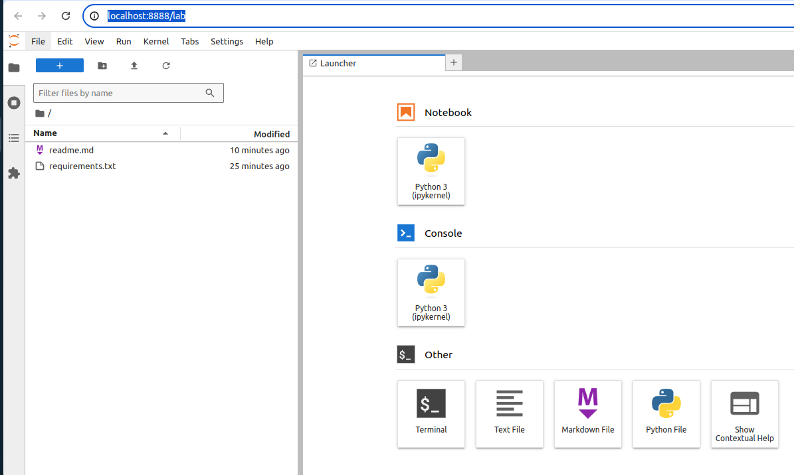
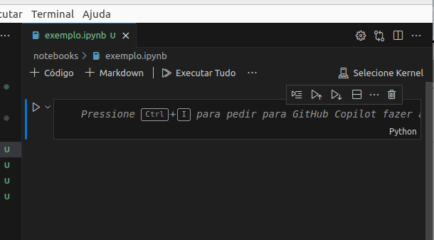

# Computação interativa

Sabemos que é possível executar código python pelo terminal do python e também escrevendo um código dentro de um arquivo `.py` e mandando o python executar. 

Existe uma outra maneira de executar código que são os _notebooks_: são arquivos que podem conter código, texto markdown, imagens, inputs interativos. 

Esses notebooks interativos foram criados pelo [Projeto Jupyter](https://jupyter.org/). 

Vou deixar algumas referências de 

- [O que são notebooks?](https://docs.jupyter.org/en/latest/#what-is-a-notebook)
- [Utilizando um notebook (online)](https://jupyter.org/try-jupyter/lab/)

## Tutorial

Instalando o jupyter lab e abrindo a aplicação

1. Crie um novo ambiente virtual chamado `venv`
2. Ative o `venv`
3. Instale o jupyter lab com o comando `pip install jupyterlab`
4. Agora, pra ter certeza que vai dar certo, precisamos desativar e ativar novamente o ambiente virtual.
5. Depois de ativar novamente o ambiente virtual, execute o comando `jupyter lab`

Vai aparecer um monte de mensagem esquisita no terminal e vai abrir automaticamente o navegador em `http://localhost:8888/lab`

Usando um notebook direto do VSCode

1. Crie um arquivo chamado `exemplo.ipynb`. Essa extensão diz que o arquivo é um `interative python notebook`. 
2. Ative o ambiente virtual `venv`
3. No terminal, digite o comando `which python`. Esse comando imprime na tela o caminho para o executável do python. Copie esse caminho.
4. No VSCode, abra o arquivo `exemplo.ipynb`. 
5. Pressione o atalho `Ctrl + Shift + P` para abrir a tela de comandos do VSCode.
6. Pesquise por `Python: Selecionar Interpretador` 
7. Irão aparecer várias opções. Escolha a opção `Insira o caminho do interpretador...`
8. Cole o caminho copiado no passo 3.
9. No canto direito superior do notebook, aparece uma opção "Selecionar Kernel". Clique nesse botão.

10. Clique na opção "Ambientes do python...". Deve aparecer a opção "venv" como Recomendada.
11. Feito isso, digite 2+3 na primeira célula do notebook e pressione `Ctrl+Enter` para executar. Deve aparecer o resultado 5 na tela.